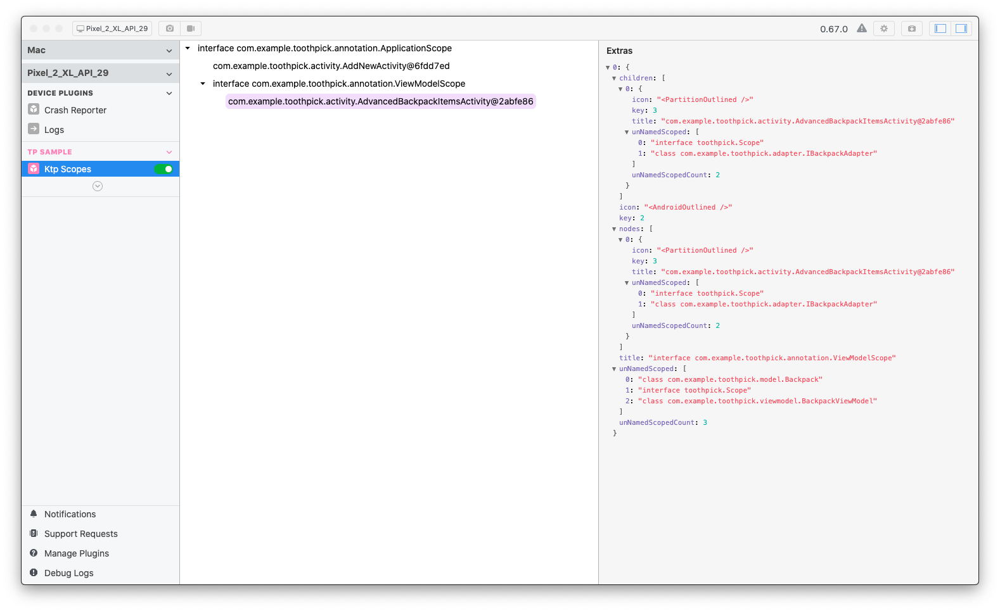

WIP

[](https://jitpack.io/#afaucogney/flipper-ktp)

Android KTP (Kotlin [Toothpick](https://github.com/stephanenicolas/toothpick)) driver for [Flipper](https://github.com/facebook/flipper).

Download
========
* Configure [Flipper](https://fbflipper.com/docs/getting-started.html)
* Top level gradle:
```kotlin
allprojects {
    repositories {
        ...
    	maven { url 'https://jitpack.io' }
		}
	}

}
```
* Dependency:

Toothpick >= 3.1.0:
```kotlin
implementation 'com.github.afaucogney:flipper-ktp:master-SNAPSHOT'
```
```
* Instantiate and add plugin to the FlipperClient. 
```kotlin
val client: FlipperClient = AndroidFlipperClient.getInstance(this)
with(client) {
    addPlugin(InspectorFlipperPlugin(this@BackpackApplication, DescriptorMapping.withDefaults()))
    addPlugin(KtpFlipperPlugin())
    start()
}
```

Usage
=====
Open Flipper app and enable Ktp plugin



Features
========
* Displaying runtime scope tree
* Displaying scope names
* Displaying scope name

Currently the plugin does'nt refresh in case of KTP scope tree change. You have to update it manually
going to another plugin and coming back. 


License
-------
    Copyright 2020 Anthony Faucogney

    Licensed under the Apache License, Version 2.0 (the "License");
    you may not use this file except in compliance with the License.
    You may obtain a copy of the License at

       http://www.apache.org/licenses/LICENSE-2.0

    Unless required by applicable law or agreed to in writing, software
    distributed under the License is distributed on an "AS IS" BASIS,
    WITHOUT WARRANTIES OR CONDITIONS OF ANY KIND, either express or implied.
    See the License for the specific language governing permissions and
    limitations under the License.
